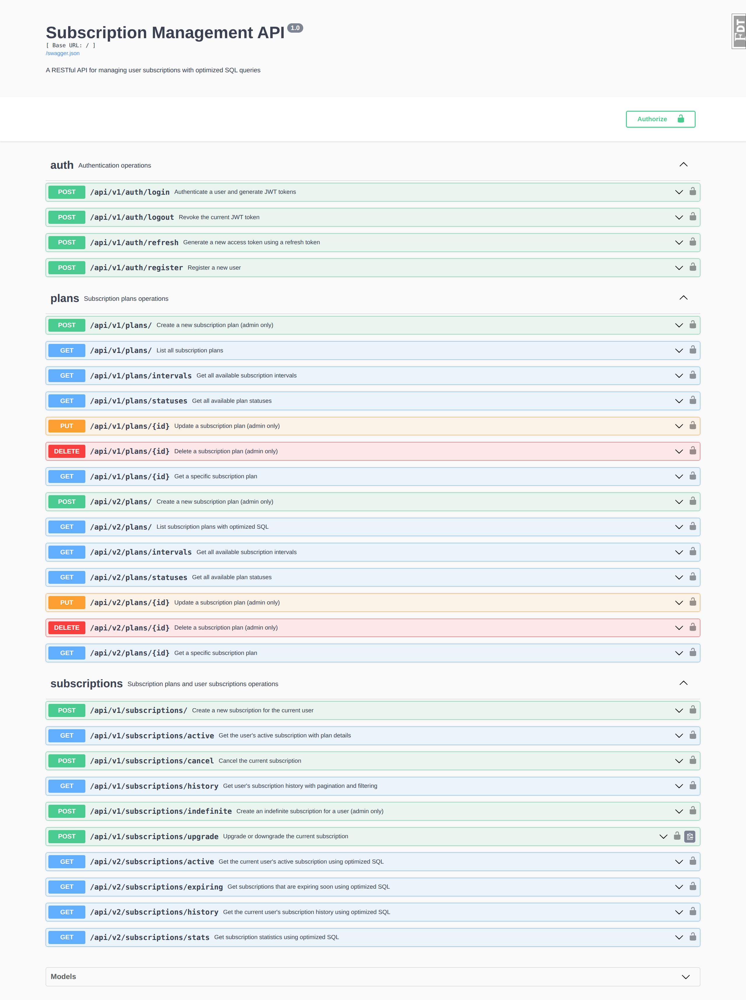
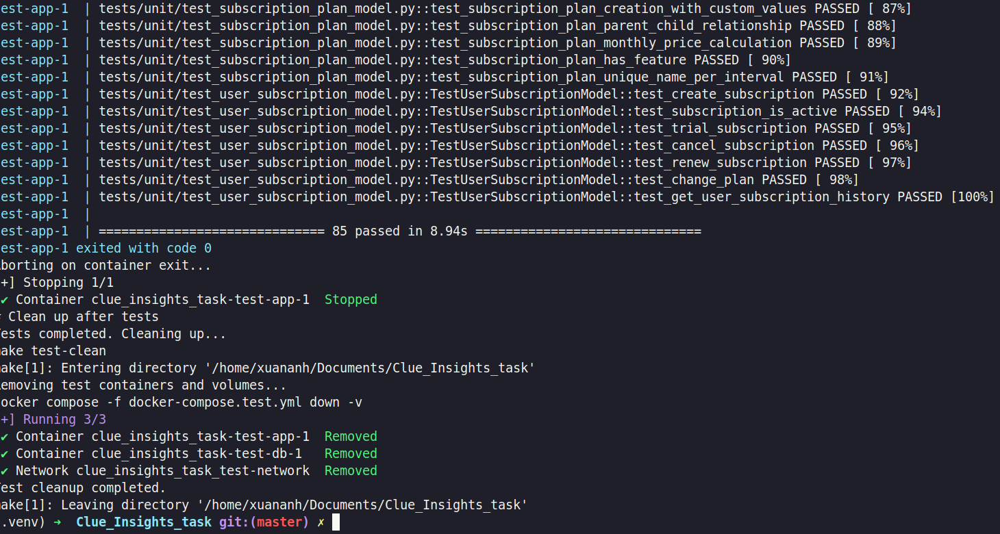
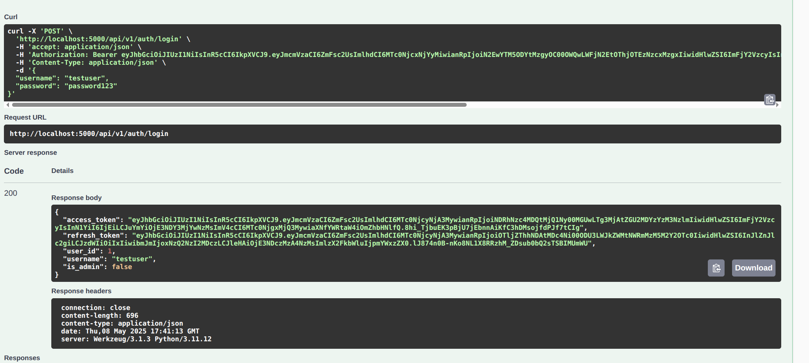
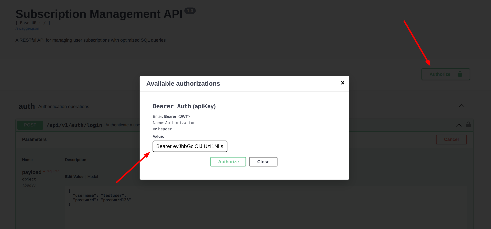
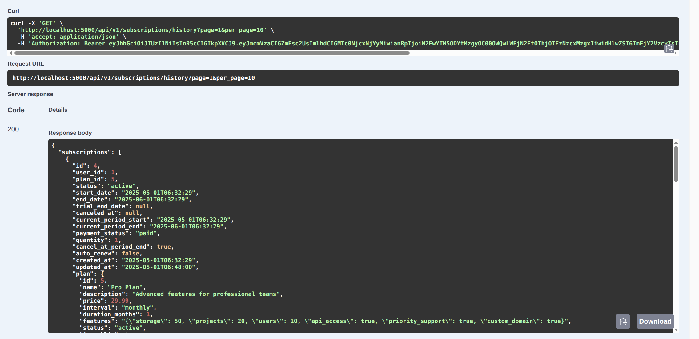

- [1. Optimized Subscription Management API](#1-optimized-subscription-management-api)
  - [1.1. Overview](#11-overview)
  - [1.2. API Versions](#12-api-versions)
    - [1.2.1. API v1](#121-api-v1)
    - [1.2.2. API v2](#122-api-v2)
    - [1.2.3. API v3](#123-api-v3)
  - [1.3. Technologies Used](#13-technologies-used)
  - [1.4. Project Structure](#14-project-structure)
  - [1.5. Setup and Installation](#15-setup-and-installation)
    - [1.5.1. Prerequisites](#151-prerequisites)
    - [1.5.2. Using Docker (Recommended)](#152-using-docker-recommended)
    - [1.5.3. Local Development with Virtual Environment](#153-local-development-with-virtual-environment)
  - [1.6. Testing](#16-testing)
  - [1.7. Create Sample Data](#17-create-sample-data)
  - [1.8. Call APIs using Swagger UI](#18-call-apis-using-swagger-ui)
    - [1.8.1. Register](#181-register)
    - [1.8.2. Login](#182-login)
    - [1.8.3. Call other APIs after logging in](#183-call-other-apis-after-logging-in)
  - [1.9. Call API using curl and jq command](#19-call-api-using-curl-and-jq-command)
    - [1.9.1. Authentication API Examples](#191-authentication-api-examples)
    - [1.9.2. Subscription API Examples](#192-subscription-api-examples)
    - [1.9.3. General Tips](#193-general-tips)
  - [1.10. Makefile Commands](#110-makefile-commands)
  - [1.11. Query Optimization Strategies](#111-query-optimization-strategies)
    - [1.11.1. Query Profiling using Flask debug toolbar](#1111-query-profiling-using-flask-debug-toolbar)
    - [1.11.2. Using SQL Explain statement to debug and optimize SQL](#1112-using-sql-explain-statement-to-debug-and-optimize-sql)
    - [1.11.3. Optimization strategies](#1113-optimization-strategies)
  - [1.12. Pagination Optimizations](#112-pagination-optimizations)
    - [1.12.1. Implemented](#1121-implemented)
    - [1.12.2. Future Optimizations](#1122-future-optimizations)
      - [1.12.2.1. Keyset (Cursor) Pagination](#11221-keyset-cursor-pagination)
      - [1.12.2.2. Count Query Optimization](#11222-count-query-optimization)
      - [1.12.2.3. Response Size Optimization](#11223-response-size-optimization)
      - [1.12.2.4. Distributed Caching](#11224-distributed-caching)
      - [1.12.2.5. Advanced Caching Strategies](#11225-advanced-caching-strategies)
      - [1.12.2.6. Query Profiling and Monitoring](#11226-query-profiling-and-monitoring)
  - [1.13. Recommendations other features](#113-recommendations-other-features)
    - [1.13.1. API \& Code Quality](#1131-api--code-quality)
    - [1.13.2. Performance \& Scalability](#1132-performance--scalability)
    - [1.13.3. Security](#1133-security)
    - [1.13.4. Testing \& Reliability](#1134-testing--reliability)
    - [1.13.5. DevOps \& Deployment](#1135-devops--deployment)
    - [1.13.6. Feature Enhancements](#1136-feature-enhancements)


# 1. Optimized Subscription Management API

A RESTful API for managing user subscriptions with optimized SQL queries.

## 1.1. Overview

This project is a Flask-based API that provides:
- User registration and authentication
- Subscription plan management
- User subscription handling (subscribe, upgrade, cancel)
- Setup Flask debug toolbar for profiling APIs and SQL
- Optimized SQL queries for subscription-related operations
- Multiple API versions with varying performance optimizations
- This project was deployed in cloud, you can test it using this url: http://167.99.70.126:5000/api/docs

## 1.2. API Versions

### 1.2.1. API v1
Standard API with ORM-based database access.

### 1.2.2. API v2
Optimized API with raw SQL queries for improved performance in high-load scenarios.
See `app/api/v2/README.md` for detailed documentation on the v2 API.

### 1.2.3. API v3
Highly optimized API with the following performance enhancements:
- In-memory caching for active subscriptions
- Optimized JOIN operations for subscription-related queries
- Selective column loading for reduced data transfer
- Improved JSON serialization for numeric types
- Strategic query optimization with eager loading techniques

See `app/api/v3/subscriptions/routes.py` for implementation details.

## 1.3. Technologies Used

- Python 3.11
- Flask and Flask-RESTx
- SQLAlchemy ORM with raw SQL optimizations
- MySQL database
- JWT authentication
- Docker and Docker Compose


## 1.4. Project Structure

```
├── app/                    # Application package
│   ├── api/                # API endpoints
│   ├── auth/               # Authentication logic
│   ├── models/             # Database models
│   ├── utils/              # Utility functions
│   └── config/             # Configuration modules
├── requirements/           # Requirements for different environments
│   ├── base.txt            # Base dependencies
│   ├── dev.txt             # Development dependencies
│   ├── test.txt            # Testing dependencies
│   └── prod.txt            # Production dependencies
├── scripts/                # Utility scripts
│   ├── create_admin.py     # Create admin user
│   ├── create_sample_plans.py # Create subscription plans
│   └── create_users_data.py # Generate large user dataset
├── tests/                  # Test suite
│   ├── unit/               # Unit tests
│   └── integration/        # Integration tests
├── docs/                   # Documentation files
│   └── profiling_queries.md # Guide for query profiling
├── init-db/                # Database initialization scripts
├── docker-compose.yml      # Docker Compose configuration for development
├── docker-compose.test.yml # Docker Compose configuration for testing
├── Makefile                # Makefile with common commands
├── app.py                  # Application entry point
├── Dockerfile              # Docker build instructions
└── install_requirements.sh # Script to install requirements
```

## 1.5. Setup and Installation

### 1.5.1. Prerequisites

- Python 3.11
- Docker and Docker Compose
- MySQL client (for local development without Docker)
- Make (for using the Makefile commands)
- OS: Ubuntu 22.04

### 1.5.2. Using Docker (Recommended)

1. Clone the repository:
   ```bash
   git clone git@github.com:PhungXuanAnh/Clue_Insights_task.git
   cd Clue_Insights_task
   ```

2. Build docker image and run services
   ```bash
   # Build docker image
   docker compose build
   
   # Run the development server
   docker compose up -d
   ```

3. Upgrade db

  ```bash
  make db-upgrade
  # or
  docker compose exec app flask db upgrade
  ```

4. Create sample data
   To test these APIs, you need to create sample data, see this part [1.7. Create Sample Data](#17-create-sample-data) for detail commands to create sample data or simply running below make command:
   ```bash
   make db-create-sample-data
   ```

5. Access the API documentation at:
   ```
   http://localhost:5000/api/docs
   ```
   

  - To test APIs using Swagger UI, see this section: [1.8. Call APIs using Swagger UI](#18-call-apis-using-swagger-ui)
  - To test APIs using Curl command, see this section: [1.9. Call API using curl and jq command](#19-call-api-using-curl-and-jq-command)

### 1.5.3. Local Development with Virtual Environment

1. Clone the repository:
   ```
   git clone git@github.com:PhungXuanAnh/Clue_Insights_task.git
   cd Clue_Insights_task
   ```

2. Create and activate a virtual environment:
   ```
   python -m venv .venv
   source .venv/bin/activate
   ```

3. Install dependencies:
   ```
   # For development
   pip install -r requirements/dev.txt
   
   # For testing
   pip install -r requirements/test.txt
   
   # For production
   pip install -r requirements/prod.txt
   
   # Or use the helper script
   ./install_requirements.sh dev  # Options: dev, test, prod
   ```

4. Run the development server:
   ```
   flask run
   ```

## 1.6. Testing

Run tests using the Makefile:

Build test image:

```bash
make test-build-image
```

Run test using this command:

```bash
# Run all tests
make test

# Run a specific test or test directory
TEST_CASE=/tests/unit/test_config.py make test
```

The test command:
1. Starts a dedicated test database container
2. Runs the tests in an isolated environment
3. Automatically cleans up all test containers and volumes when done

    

## 1.7. Create Sample Data

Run upgrade db again to ensure tables are created:

```bash
make db-upgrade
```

To create sample subscription plans for testing and development:

```bash
docker exec -it clue_insights_task-app-1 python /src/scripts/create_sample_plans.py
```

This will create the following subscription plans if they don't already exist:
- Free Plan (monthly, $0)
- Basic Plan (monthly, $9.99)
- Pro Plan (monthly, $29.99)
- Basic Plan (Annual, $99.99)
- Pro Plan (Annual, $299.99)

You can verify the created plans by accessing the API endpoint:

```bash
curl -X GET "http://localhost:5000/api/v1/plans/" -H "accept: application/json" | jq
```

To create an admin user for testing:
```bash
docker exec -it clue_insights_task-app-1 python /src/scripts/create_admin.py
```

The default admin credentials are:
- Username: admin
- Password: admin123

To generate a large dataset of 1 million users with various subscription scenarios:

```bash
docker exec -it clue_insights_task-app-1 python /src/scripts/create_users_data.py
```

This will create 1 million users with the following distribution:
- 250,000 users on each of the 5 subscription plans
- 200,000 users with subscriptions expiring soon
- 150,000 new users (registered within the last 7 days)
- 100,000 users who recently canceled

**NOTE**: the above command will create 1 million users, so it will take a long time. To make it quicker, you can specify number of user to create in above command, for example:

```bash
docker exec -it clue_insights_task-app-1 python scripts/create_users_data.py --number_user 100
```

## 1.8. Call APIs using Swagger UI

### 1.8.1. Register

Register an user using POST /api/v1/auth/register

### 1.8.2. Login

Login using POST /api/v1/auth/login



It will return an access token, using this token to login in swagger UI



### 1.8.3. Call other APIs after logging in



## 1.9. Call API using curl and jq command

### 1.9.1. Authentication API Examples

1. **Register a new user**:
```bash
curl -X POST http://localhost:5000/api/v1/auth/register \
  -H "Content-Type: application/json" \
  -d '{"username": "testuser", "email": "test@example.com", "password": "password123"}' | jq
```

2. **Login with username and password**:
```bash
curl -X POST http://localhost:5000/api/v1/auth/login \
  -H "Content-Type: application/json" \
  -d '{"username": "testuser", "password": "password123"}' | jq
```

3. **Refresh an access token**:
```bash
curl -X POST http://localhost:5000/api/v1/auth/refresh \
  -H "Authorization: Bearer YOUR_REFRESH_TOKEN" | jq
```

4. **Logout (revoke token)**:
```bash
curl -X POST http://localhost:5000/api/v1/auth/logout \
  -H "Authorization: Bearer YOUR_ACCESS_TOKEN" | jq
```

### 1.9.2. Subscription API Examples

1. **Get subscription plans**:
```bash
curl -X GET http://localhost:5000/api/v1/subscriptions/plans \
  -H "Authorization: Bearer YOUR_ACCESS_TOKEN" | jq
```

2. **Subscribe to a plan**:
```bash
curl -X POST http://localhost:5000/api/v1/subscriptions/subscribe \
  -H "Content-Type: application/json" \
  -H "Authorization: Bearer YOUR_ACCESS_TOKEN" \
  -d '{"plan_id": 1}' | jq
```

3. **Get user subscriptions**:
```bash
curl -X GET http://localhost:5000/api/v1/subscriptions/user \
  -H "Authorization: Bearer YOUR_ACCESS_TOKEN" | jq
```

### 1.9.3. General Tips

1. Store tokens in variables for easier use:
```bash
# Login and save tokens
TOKENS=$(curl -s -X POST http://localhost:5000/api/v1/auth/login \
  -H "Content-Type: application/json" \
  -d '{"username": "testuser", "password": "password123"}')

# Extract tokens
ACCESS_TOKEN=$(echo $TOKENS | jq -r '.access_token')
REFRESH_TOKEN=$(echo $TOKENS | jq -r '.refresh_token')

# Use tokens in subsequent requests
curl -X GET http://localhost:5000/api/v1/subscriptions/plans \
  -H "Authorization: Bearer $ACCESS_TOKEN" | jq
```

2. Testing with different APIs using token, for example api get subscriptions history
```bash
curl -X 'GET' \
  'http://localhost:5000/api/v1/subscriptions/history?page=1&per_page=10' \
  -H 'accept: application/json' \
  -H "Authorization: Bearer $ACCESS_TOKEN" \
  | jq
```

## 1.10. Makefile Commands

This project includes several helpful make commands to streamline development:

- `make setup`: Sets up the development environment
- `make run`: Starts the development server
- `make test`: Runs all tests (or a specific test with `TEST_CASE=path/to/test.py`)
- `make test-clean`: Removes all test containers and volumes
- `make db-init`: Initializes database migrations (creates migrations directory)
- `make db-migrate`: Generates a new migration (use with `message="Migration description"`)
- `make db-upgrade`: Applies migrations to update the database schema
- `db-create-sample-data`: Create sample data for testing

## 1.11. Query Optimization Strategies


### 1.11.1. Query Profiling using Flask debug toolbar

The development environment includes Flask-DebugToolbar for profiling SQL queries:

1. Access any APIs with parameter `_debug=true` in development mode
2. Use the SQLAlchemy panel to identify slow queries

See [docs/profiling_queries.md](docs/profiling_queries.md) for detailed instructions on profiling.

**NOTE**: this toolbar only work with HTML response, so to use it to test API with json response, I registered a function to wrap JSON responses in HTML when `_debug=true` is in the URL params, see this file for more detail [src/app/__init__.py](src/app/__init__.py)

### 1.11.2. Using SQL Explain statement to debug and optimize SQL 

The `EXPLAIN` statement in SQL is used to understand how a database executes a query. It provides insight into the query execution plan, helping to optimize and debug the query.

### 1.11.3. Optimization strategies

1. **Custom SQL for performance-critical operations:**
   - Raw SQL queries in v2 API endpoints for direct database access
   - Optimized JOIN operations with careful index utilization
   - Single-query data retrieval reducing round trips to the database

2. **Strategic indexing for common query patterns**
3. **Efficient pagination implemented at the database level**
4. **JSON serialization optimizations for Decimal and DateTime types**
5. **In-memory caching for frequently accessed data (v3 API):**
   - Active subscription caching with TTL-based expiration
   - **Paginated plan list and subscription history caching (first page, common filters) with TTL-based expiration**
   - Cache invalidation on subscription or plan changes (create, update, delete)
   - Configurable cache TTL settings
   - **Test isolation: cache is cleared at the start of each test request to avoid test pollution**

6. **Selective column loading for reduced data transfer (v3 API):**
   - Using SQLAlchemy's `load_only()` to request only needed columns
   - Reducing network traffic and serialization overhead

7. **Optimized JOIN strategies (v3 API):**
   - Using `contains_eager()` and `joinedload()` to minimize database queries
   - Proper relationship loading to avoid the N+1 query problem

For examples of these optimizations, see:
- `app/utils/sql_optimizations.py` - Raw SQL implementations
- `app/api/v2/` - Optimized API endpoints using raw SQL
- `app/api/v3/subscriptions/routes.py` - Advanced optimizations including caching and selective loading

See the API documentation for detailed explanations of specific optimizations.

## 1.12. Pagination Optimizations

### 1.12.1. Implemented

The following improvements are **implemented** to enhance pagination performance:

- **[Implemented] All relevant composite indexes for filter/sort/pagination columns are present and verified in the models.**
- **[Implemented in v3] Cache paginated results (first page, common filters) for plan lists and subscription history with appropriate TTL values**
- **[Implemented] In test mode, cache is cleared at the start of each test request to ensure test isolation**
- Use query parameters as part of cache keys
- Implement cache invalidation when underlying data changes (create, update, delete)

For additional recommendations and future improvements, see the next section.

### 1.12.2. Future Optimizations

The following optimizations are recommended for future work to further enhance performance, scalability, and flexibility:

#### 1.12.2.1. Keyset (Cursor) Pagination
- Replace current offset-based pagination with cursor-based (keyset) pagination for better performance with large datasets.
- Use a unique identifier (like ID) combined with a timestamp as the cursor.
- Avoid the "count from beginning" problem of offset pagination.
- Maintain consistent performance regardless of page depth.
- Implementation should use WHERE clauses with comparison operators instead of OFFSET.

#### 1.12.2.2. Count Query Optimization
- Use approximate counts for very large datasets.
- Consider lazy/deferred counting mechanisms.
- Cache count results with appropriate invalidation.
- Implement "more results" indicators instead of exact counts where appropriate.

#### 1.12.2.3. Response Size Optimization
- Implement sparse fieldsets allowing clients to request only needed fields.
- Consider compression for large response payloads.
- Use projection queries to select only necessary columns.
- Implement view models to return only required data.

#### 1.12.2.4. Distributed Caching
- Move from in-memory cache to a distributed cache (e.g., Redis) for scalability in production environments.
- Support cache invalidation across multiple app instances.

#### 1.12.2.5. Advanced Caching Strategies
- Cache additional pages (not just the first) for high-traffic queries.
- Implement cache warming and prefetching for common queries.
- Use cache versioning or tagging for more granular invalidation.

#### 1.12.2.6. Query Profiling and Monitoring
- Automate query profiling and alerting for slow queries.
- Integrate with monitoring tools to track cache hit/miss rates and query performance.

These recommendations can be implemented incrementally, with keyset pagination and distributed caching providing the most immediate performance benefits for large datasets and production deployments.

## 1.13. Recommendations other features

### 1.13.1. API & Code Quality
- **Consistent Error Handling:** Use a global error handler to standardize error responses (with error codes and messages) across all endpoints.
- **Request Validation:** Consider using Marshmallow or Flask-RESTX's request parsing for stricter input validation and better error messages.

### 1.13.2. Performance & Scalability
- **Database Connection Pooling:** Ensure SQLAlchemy connection pooling is configured for production workloads.
- **Query Profiling in CI:** Automate query profiling in your CI pipeline to catch regressions in query performance.
- **Rate Limiting:** Add rate limiting (e.g., Flask-Limiter) to protect authentication and subscription endpoints from abuse.

### 1.13.3. Security
- **Password Policies:** Enforce stronger password policies (e.g., minimum length, complexity, common password blacklist).
- **JWT Security:** Rotate JWT secret keys regularly and consider short-lived access tokens with refresh tokens.
- **Audit Logging:** Log sensitive actions (e.g., subscription changes, admin actions) for auditability.

### 1.13.4. Testing & Reliability
- **Test Coverage Reports:** Integrate coverage reporting (e.g., Codecov) to monitor and enforce high test coverage.
- **Load Testing:** Use tools like Locust or k6 to simulate real-world load and identify bottlenecks.

### 1.13.5. DevOps & Deployment
- **Health Checks:** Add health check endpoints for Docker/Kubernetes readiness and liveness probes.
- **Environment-Specific Configs:** Use environment variables and config files to separate dev, test, and prod settings.
- **Automated Migrations:** Automate Alembic migrations as part of your deployment pipeline.

### 1.13.6. Feature Enhancements
- **Subscription Webhooks:** Add support for webhooks to notify external systems of subscription events (created, canceled, upgraded).
- **Admin Dashboard:** Build a simple admin dashboard (even as a Flask-Admin view) for managing users and subscriptions.
- **User Notifications:** Integrate email or in-app notifications for subscription changes, renewals, and expirations.
- **Email verification:** Add feature email verification when register account.