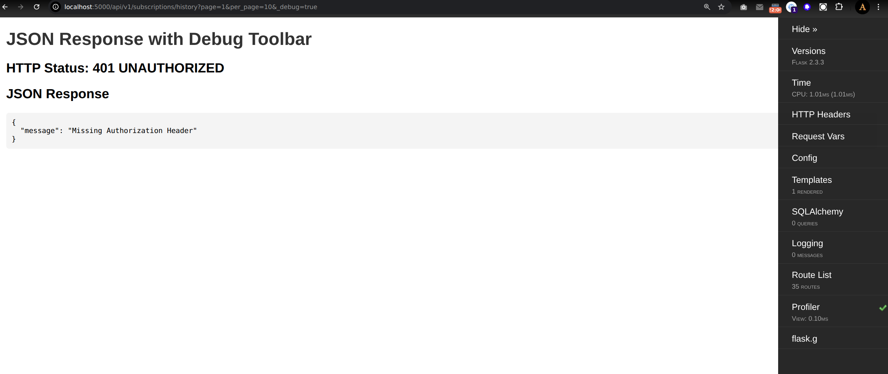
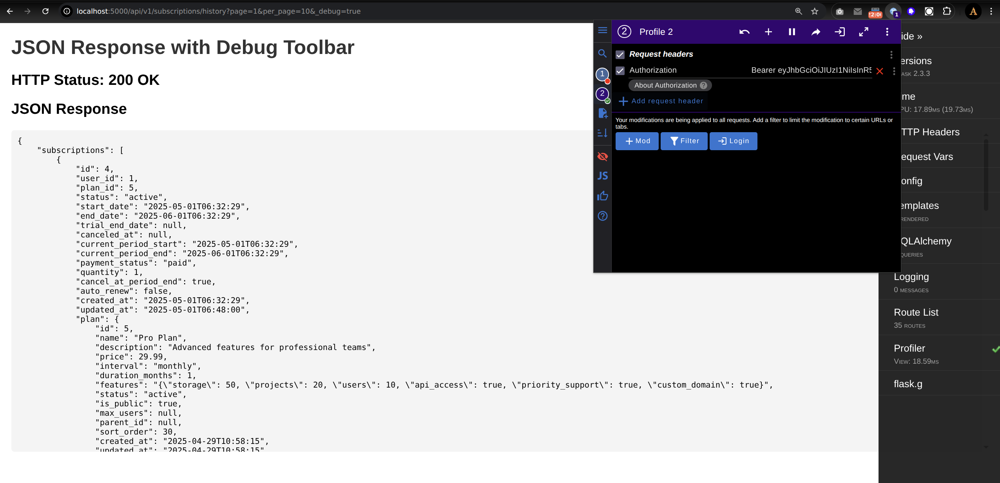
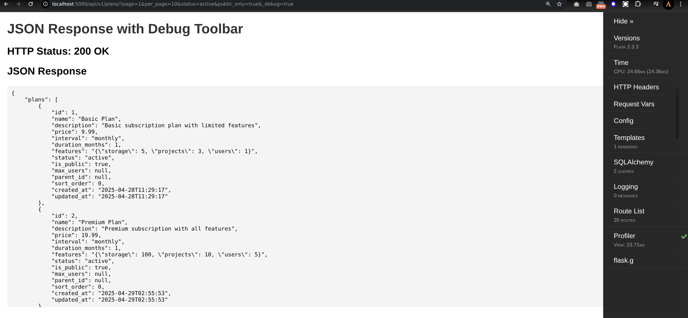
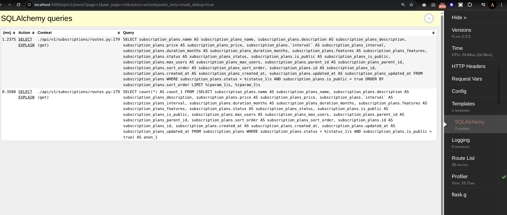
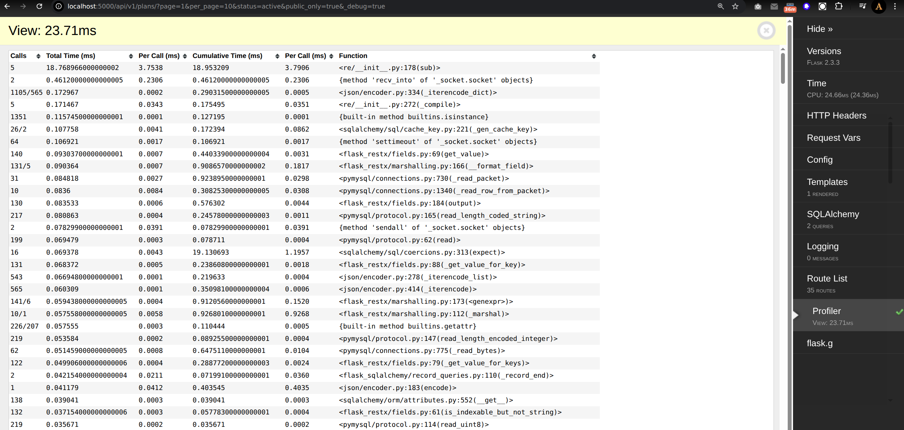

**Profiling Slow Queries with Flask-DebugToolbar**

This document explains how to use Flask-DebugToolbar to identify and optimize slow queries in our application.

- [1. Setup](#1-setup)
- [2. Accessing the Toolbar](#2-accessing-the-toolbar)
- [3. Using the SQLAlchemy Panel](#3-using-the-sqlalchemy-panel)
- [4. Using the Profiler Panel](#4-using-the-profiler-panel)
- [6. Example Optimization Workflow](#6-example-optimization-workflow)

# 1. Setup

Flask-DebugToolbar has been integrated into the project for development environments. The toolbar automatically appears on HTML responses when running in debug mode (which is enabled by default in development).

**NOTE**: this toolbar only work with HTML response, so to use it to test API with json response, I registered a function to wrap JSON responses in HTML when `_debug=true` is in the URL params, see this file for more detail [src/app/__init__.py](src/app/__init__.py)

# 2. Accessing the Toolbar

1. Run the application in development mode
2. Access any HTML endpoint in the browser, for example: http://localhost:5000/api/v1/plans/?page=1&per_page=10&status=active&public_only=true&_debug=true
   1. With API, that requires jwt token, you can login to get token and then use an chrome extension to add token in the header of request, for example, if I call API get subscriptions history without token: , then I used a chrome extension named: Modheader to help me test this API 
3. The debug toolbar will appear on the right side of the page 
4. Click on the "SQLAlchemy" tab to view executed queries 
5. Click on the "Profiler" tab to view execution times 

# 3. Using the SQLAlchemy Panel

The SQLAlchemy panel shows:
- All executed queries
- Query execution time
- Context in which the query was executed
- Number of rows returned

This information helps identify:
- N+1 query problems
- Missing indexes
- Inefficient joins
- Redundant queries

# 4. Using the Profiler Panel

The Profiler panel provides:
- Function-level profiling data
- Call hierarchy
- Execution time per function
- Cumulative time including nested calls

To enable the profiler for all requests:
1. Set `DEBUG_TB_PROFILER_ENABLED = True` (already configured)
2. Refresh the page to see profiling data

# 6. Example Optimization Workflow

1. Identify slow queries using the debug toolbar
2. Examine the query execution plan using `EXPLAIN`
3. Add appropriate indexes to improve query performance
4. Consider using eager loading (`joinedload()`, `selectinload()`, etc.) for related data
5. For complex operations, consider raw SQL optimizations
